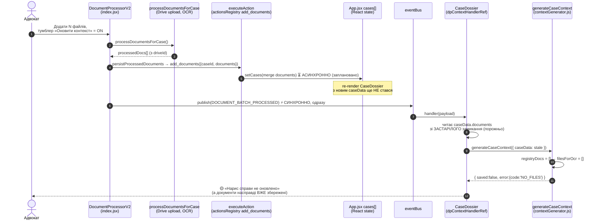
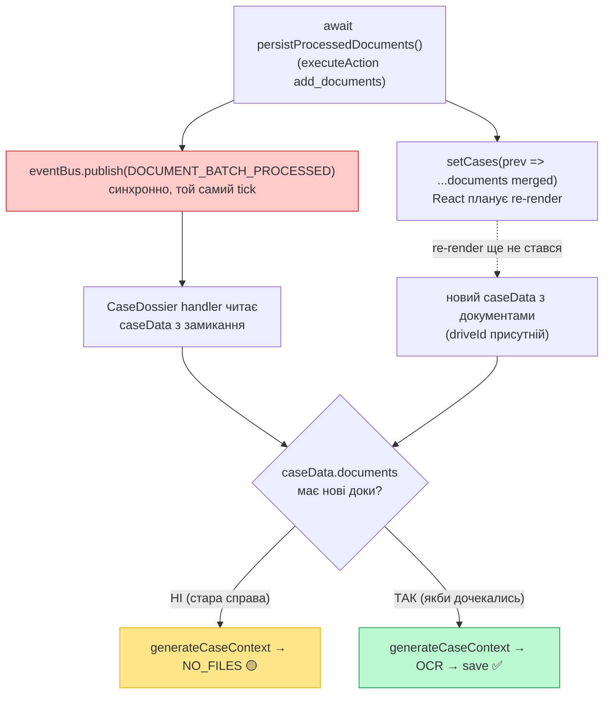
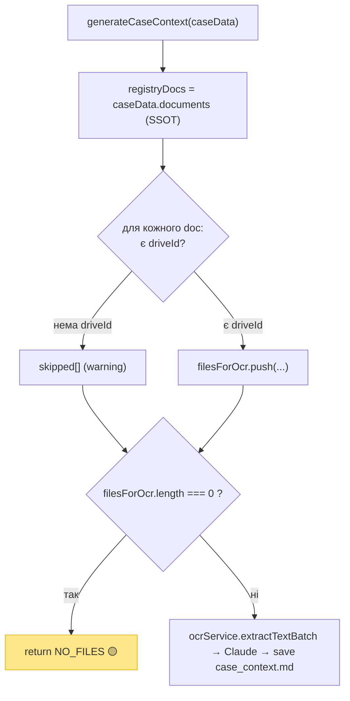

# Діагностика: потік оновлення case_context.md при додаванні документів через Document Processor

**Дата:** 2026-05-31
**Симптом:** на чисту справу (0 документів, без case_context.md) додано N документів
через Document Processor з увімкненим тумблером «Оновити case_context.md». Результат:
тост «Додано N документ(а)» (зелений) + одразу «Нарис справи не оновлено» (жовтий,
причина `NO_FILES` — «У справі немає документів з файлами на Drive»).

**Діагноз:** гонка React-стану. Подія `DOCUMENT_BATCH_PROCESSED` публікується
синхронно одразу після `executeAction('add_documents')`, але `setCases` (оновлення
метаданих справи) — асинхронне. Контекст-хендлер у `CaseDossier` читає `caseData`
зі **застарілого замикання** (ще порожня справа) → генератор не бачить документів →
`NO_FILES`. Дані при цьому збережені правильно.

**Важливо:** метадані справи (`caseData.documents`) — канонічний SSOT, і це
правильно. Генератор теж правильно повертає `NO_FILES` коли документів немає.
Дефект **не** в SSOT і **не** в генераторі окремо — а в **таймінгу тригера**:
контекст стартує до того, як метадані встигли оновитися. Генератор має працювати
не як копія з «Огляду», а **в купі з Document Processor** — дочекатися появи
документів у метаданих, а тоді стартувати.

---

## Поточний потік (як є зараз)



### Точка гонки (один кадр)



---

## Логіка генератора (де саме повертається NO_FILES)

`src/components/CaseDossier/services/contextGenerator.js:471-491`



`NO_FILES` = у справі **жоден документ не має driveId** (зокрема коли документів
узагалі нема). Поведінка коректна для справді порожньої справи; проблема лише в
тому, що хендлер бачить справу порожньою через гонку, хоча документи вже додані.

---

## Ключові файли і рядки

| Що | Файл:рядок |
|----|-----------|
| Публікація події (синхронно після persist) | `src/components/DocumentProcessorV2/index.jsx:941` |
| persist → executeAction add_documents | `src/components/DocumentProcessorV2/services/persistDocuments.js:12-14` |
| add_documents handler → setCases (async) | `src/services/actionsRegistry.js:199-211` |
| Контекст-хендлер читає caseData з замикання | `src/components/CaseDossier/index.jsx:740-800` |
| Підписка на подію (mount-time) | `src/components/CaseDossier/index.jsx:802-808` |
| NO_FILES guard | `src/components/CaseDossier/services/contextGenerator.js:489-491` |

---

## Напрями виправлення (для обговорення — НЕ реалізовано)

Спільна ідея: контекст має стартувати **після** того, як метадані справи відобразили
нові документи (SSOT не чіпаємо). Варіанти:

1. **Тригер через effect, що спостерігає метадані (React-ідіоматично).** Подія лише
   ставить «намір» (`pendingContextRegenForCaseId`). Окремий `useEffect`, що залежить
   від `caseData.documents`, запускає генерацію щойно документи з'явилися. Потрібен
   guard від нескінченного очікування (звірка з `payload.documentsAdded`, або
   таймаут), і захист від повторних запусків.

2. **Передати свіжі документи в payload події.** DP уже має `processedDocs` (з
   driveId) на момент emit — покласти їх у `DOCUMENT_BATCH_PROCESSED` і дати
   генератору. Мінус: частково обходить SSOT (метадані), хоча дані ті самі.

3. **Хендлер читає свіжий стан через getter, а не замикання.** Дати CaseDossier
   доступ до `getCases()`/латест-ref і брати найсвіжішу справу в момент генерації.
   Усе ще можлива гонка з самим `setCases` у тому ж tick — менш надійно за варіант 1.

Рекомендований до обговорення: **варіант 1** (intent + effect на метаданих) — він
єдиний строго відповідає принципу «дочекатися оновлення SSOT, тоді стартувати» і не
дублює дані. Деталі guard'ів узгодити перед реалізацією.
```
