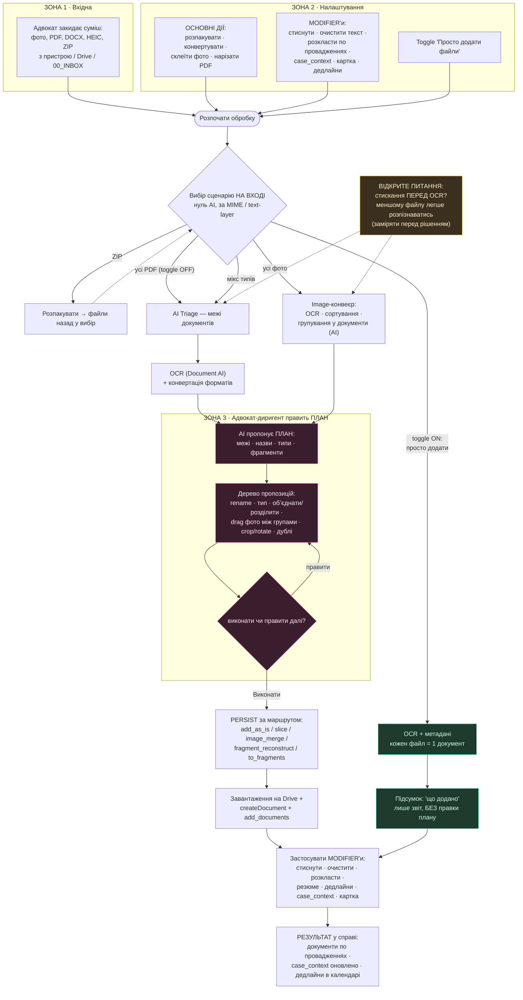

# Document Processor — повний запланований флоу (схема)

**Дата:** 2026-05-29
**Призначення:** візуальна мапа DP (візія + поточний стан). Рендериться на GitHub
і в будь-якому mermaid-переглядачі.
**Повʼязане:** `docs/consultations/consultation_dp_product_vision.md`,
`docs/consultations/consultation_dp_flow_observations.md` (спостереження адвоката).

> Виправлено після зауваження адвоката (2026-05-29): гілка тумблера
> «Просто додати файли» **оминає** крок правки плану — див. спостереження #1.

## Легенда

- **Зелене (тумблер ON)** — «Просто додати файли»: оминає правку плану, кожен файл
  лягає як є, лише підсумок «що додано». Жодного редагування — у цьому й сенс тумблера.
- **Рожеве** — гейт «адвокат править план». Реальний зараз тільки для **фото** (1B);
  для **нарізки PDF** — Фаза 5 (зараз автопідтвердження).
- **Жовте** — відкрите питання: чи варто стискати файли **перед** OCR (спостереження #2).

## Ключові принципи

1. **Cheap before Expensive** — сценарій обирається на вході без AI (за типом файлу).
   AI вмикається лише ВСЕРЕДИНІ сценарію (групування фото, межі PDF).
2. **Тумблер «Просто додати» = довіра** — оминає будь-яку правку, додає як є.
3. **Гейт правки плану** — серце візії; для нарізки PDF досі не реалізований (Фаза 5).
4. **Modifier'и** застосовуються ПІСЛЯ створення документів (а можливо частина —
   стискання — має переїхати на вхід; спостереження #2).
