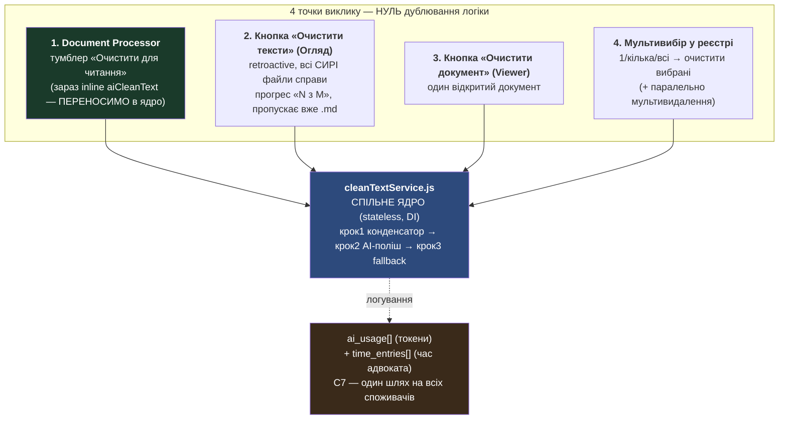
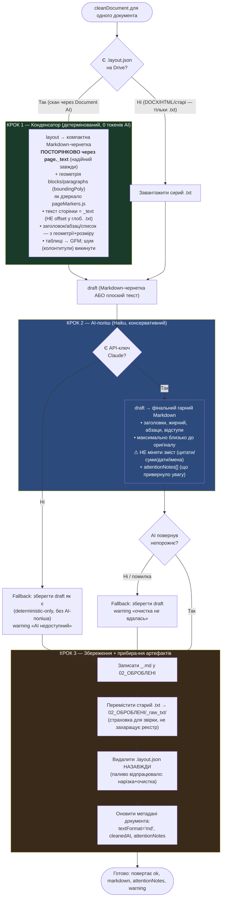
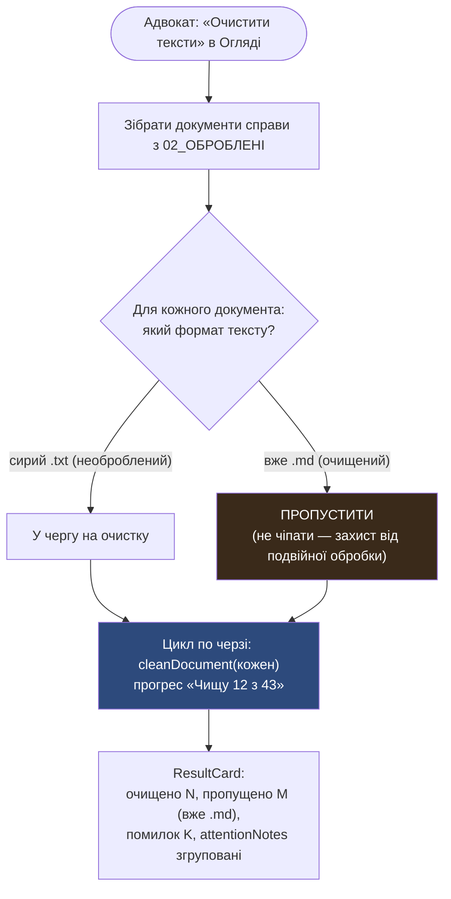
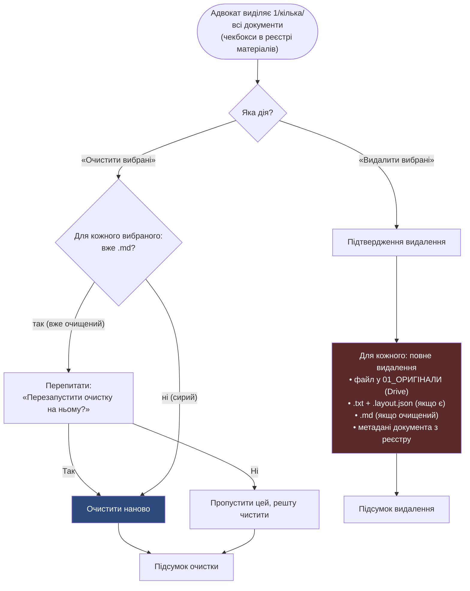

# Flow: очищення тексту документа (clean text → Markdown) — TASK 3, смуга C

> Тип: flow + sequence діаграми (тримати синхронно з кодом). Це **алгоритм для
> узгодження ПЕРЕД написанням таск-спеки**. Адвокат дивиться, узгоджує, тоді
> пишемо `docs/tasks/TASK_3_clean_text.md`.

**Дата:** 2026-05-31 (оновлено: крок 1 читає layout посторінково через `_text` + геометрія)
**Базовий дизайн:** `docs/consultations/consultation_clean_text_design.md` (SSOT наміру)
**Патерн:** дзеркало `contextGenerator` — ОДНЕ ядро, кілька споживачів (Rule of Three / #11)

---

## Суть у двох реченнях

Сирий OCR-текст (`.txt`) читати незручно: розірвані переноси, злиплі колонки,
сміття розпізнавання. Функція робить з нього **гарний Markdown-документ** (`.md`)
максимально близький до оригіналу — абзаци, заголовки, жирний шрифт, таблиці —
**не змінюючи юридичний зміст** (краще лишити сміття, ніж зіпсувати зміст).

---

## Архітектура: одне ядро — чотири точки виклику

**Ключове рішення (підтверджено адвокатом 2026-05-31):** `aiCleanText`, що зараз
живе inline у `DocumentPipelineContext.jsx` (DP-зачаток), **витягується** у спільне
ядро. DP перестає мати власну копію — стає споживачем #1, як решта.

---

## Ядро: 3-кроковий гібрид (один виклик `cleanDocument`)

**Чому гібрид, а не просто AI (узгоджено):** конденсатор коштує **0 AI-токенів**
(просто CPU), тому гібрид ніколи не дорожчий за чистий AI. Його справжня цінність —
**єдиний токен-доступний спосіб донести структуру layout до AI**: сирий layout у
промпт = втричі дорожче; плоский .txt = втрачені таблиці/колонки. Конденсатор
стискає layout у компактну структуровану чернетку → AI полірує у фінал.

---

## Точка 2: кнопка «Очистити тексти» в Огляді (retroactive, N документів)

**Змішаний кейс (важливо):** у справі можуть бути і `.md` (додані раніше з
очисткою), і `.txt` (додані без неї). Кнопка в Огляді чіпає **ТІЛЬКИ сирі .txt**,
готові `.md` не перезапускає.

---

## Точка 4: мультивибір у реєстрі (+ мультивидалення)

**Примітка:** мультивидалення — окрема дія, прикручена «попутно» (раз робимо
мультивибір у реєстрі — логічно додати і пакетне видалення). Зараз видалення —
по одному; стане 1/кілька/всі.

---

## Долі артефактів (зведена таблиця)

| Артефакт | До очистки | Після очистки | Чому |
|----------|-----------|---------------|------|
| `<basename>_<id>.md` | — | **створюється** у 02_ОБРОБЛЕНІ | viewer показує його; фінальний гарний документ |
| `<basename>_<id>.txt` (сирий) | у 02_ОБРОБЛЕНІ | **переміщається** у `02_ОБРОБЛЕНІ/_raw_txt/` | страховка для звірки, не захаращує реєстр (дефолт, переглядається пізніше) |
| `<basename>_<id>.layout.json` | у 02_ОБРОБЛЕНІ | **видаляється назавжди** | паливо відпрацювало (нарізка + конденсатор); метадані вже використані |
| метадані документа | `textFormat='txt'` | `textFormat='md'`, `cleanedAt`, `attentionNotes[]` | viewer/контекст-генератор/агент читають «.md якщо є, інакше .txt» |

---

## Що TASK 3 НЕ робить (межі — у спеці деталізуємо)

- ❌ re-OCR одного документа за сумнівом (§5 дизайну) — концептуально закладаємо,
  але реалізація — наступний крок (борг).
- ❌ Не чіпає `DpImageMergeEditor`, `ImageMergePanel`, `App.jsx` (паралельні смуги B/A).
- ❌ Не змінює промпт `contextGenerator` (окремий сервіс).

---

## Як крок 1 читає layout — ВИРІШЕНО (дослідження offset'ів, 2026-05-31)

Перевірено по коду `documentAi.js` + `pageMarkers.js`:

| Факт | Доказ у коді | Наслідок |
|------|--------------|----------|
| Offset'и абзаців ламаються на сканах >25 стор. | `documentAi.js:428-435` — при склейці чанків перебазовується ТІЛЬКИ `pageNumber`, offset'и в `paragraphs/blocks` лишаються по-чанковими; глобальний `.txt` склеєний з `--- Page break ---` (рядок 451) | Наївний `slice` по offset'ах з 2-го+ чанка дасть **зміщений текст** → так робити НЕ можна |
| `page._text` коректний завжди | `documentAi.js:224` — рахується per-page ДО склейки, проти тексту свого чанка | Безпечне джерело тексту на 1 і 100 сторінках |
| Геометрія виживає в `.layout.json` | `STRIPPED_LAYOUT_FIELDS=['image','tokens']` — `paragraphs/blocks/tables/boundingPoly/dimension/_text` лишаються | Структуру (заголовок/абзац/таблиця) можна вивести з геометрії |
| Патерн уже усталений у системі | `pageMarkers.js:104-105` — дослівно «offset-математика по чанках ненадійна — `_text` вже посторінковий»; читає `_text` + `boundingPoly` | Наша функція **дзеркалить** цей патерн (можливо перевикористовує `orderedBlocks`/`blockBox`); інакше — другий конфліктний спосіб читати layout (#11) |

**Рішення: Варіант B** — посторінково через `_text` + геометрія layout. НЕ Варіант A
(offset-резолюція проти .txt), бо A крихкий на довгих сканах і вимагав би або
лагодити стабільний OCR-склеювач (ризик для всього робочого), або завести другий
спосіб читання (порушення #11). B стійкий, нуль ризику для OCR-пайплайна, і вже
є прецедент у `pageMarkers.js`.

**Наслідок для зламаного leftover:** його reader (очікує вигаданий `{type,text}`)
переписується під реальний Google-shape per-page через `_text` + геометрію.

**Скоуп підтверджено:** clean-text лише для `documentNature==='scanned'` (бо
`.layout.json` дає тільки Document AI на сканах). DOCX/HTML/searchable → лише `.txt`
без layout → крок 1 пропускається, йдуть у fallback (плоский текст → AI).

---

## Відкриті деталі для спеки (не для діаграми)

1. Точний `agentType` для `resolveModel` (новий `text_cleaner`?) і `logAiUsage` context.
2. Білінг: чи нараховувати DP-шлях (автоматичний) інакше ніж кнопку Огляду (дія адвоката).
3. Чи viewer уже рендерить `.md` (перевірити `DocumentViewer`).

---

**Це алгоритм для узгодження. Після «ок» від адвоката → пишемо `docs/tasks/TASK_3_clean_text.md`.**
