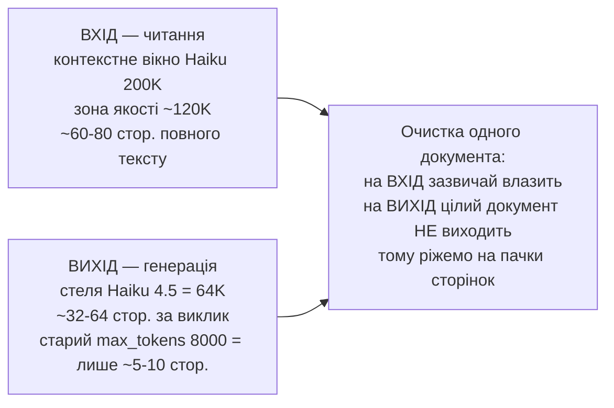
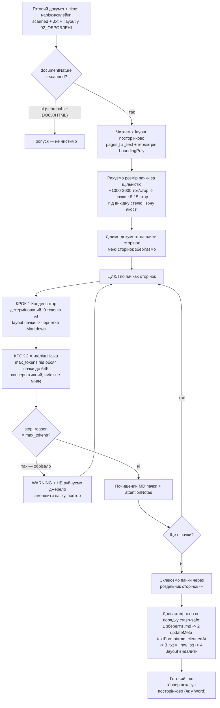
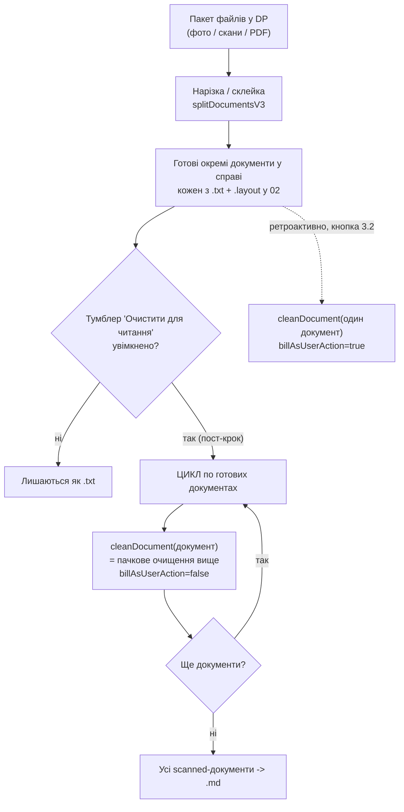

# Flow: посторінкове (пачкове) очищення тексту — TASK 3.1 (доповнення)

**Дата:** 2026-06-01
**Контекст:** уточнення до `flow_clean_text.md` після обговорення з адвокатом.
Очищення працює **на одному готовому документі**, а всередині документа —
**пачками по сторінках** (бо весь документ за одну відповідь AI не виходить).
Споріднено з дослідженням щільності `TASK_smart_triage_passport_scale_and_text.md`
(кирилиця ~2 символи/токен; ~1000-2000 токенів/стор.; вікно Haiku 200K; стеля
виходу Haiku 4.5 = 64K).

---

## Два РІЗНІ бюджети (чому потрібні пачки)

Дослідження щільності міряло **вхід** (скільки Haiku прочитає за раз — ~70 стор.,
`RICH_PASSPORT_MAX_PAGES_DEFAULT`). Проблема очистки — у **виході** (скільки
згенерує). Це різні ліміти; очистку обмежує менший — вихід.

---

## Як обробляється ОДИН документ (пачкове очищення)

---

## Де це у потоці всієї обробки (документ за документом)

Тумблер у DP і кнопки 3.2/3.3 кличуть **те саме** `cleanDocument` — різниця лише
коли (авто в кінці vs руками) і `billAsUserAction`.

---

## Числа (для розрахунку пачок)

| Параметр | Значення | Джерело |
|---|---|---|
| Щільність кирилиці | ~2 символи / токен | `TASK_smart_triage_passport_scale_and_text.md` |
| Повний юр-текст | ~1000-2000 токенів / стор. | те саме |
| Вхід — вікно Haiku | 200K, зона якості ~120K (~60-80 стор.) | те саме + `RICH_PASSPORT_MAX_PAGES_DEFAULT=70` |
| Вихід — стеля Haiku 4.5 | **64K** (API-ліміт Anthropic) | docs.anthropic.com |
| Старий `max_tokens` | 8000 (~5-10 стор.) — спадок, піднімаємо | `cleanTextService.js:306` |
| Рекомендована пачка | ~8-15 стор. (≈12-30K вихідних токенів) | розрахунок |

---

## Що НЕ робимо

- ❌ НЕ чистимо весь документ одним викликом якщо він > ~30 стор. (обріже на виході).
- ❌ НЕ руйнуємо сирий `.txt`/`.layout` поки очистка не завершилась успішно (і не при обрізанні).
- ❌ НЕ ламаємо межі сторінок (вони потрібні для посторінкового в'ювера).
- ❌ НЕ плутаємо вхідний бюджет (200K, читання) з вихідним (64K, генерація).
- ❌ НЕ ставимо `max_tokens` > 64000 (Haiku 4.5 відхилить запит).
