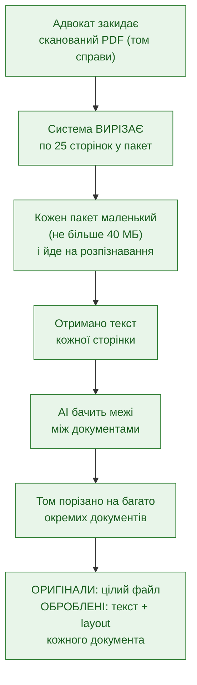
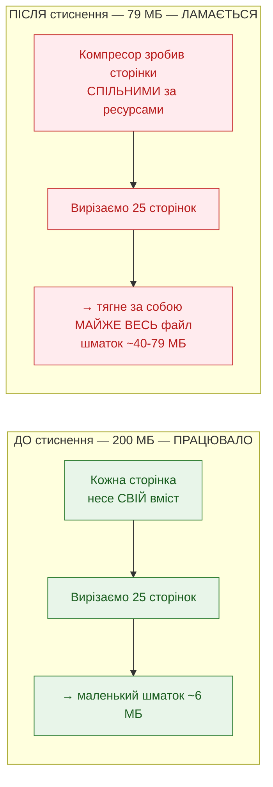
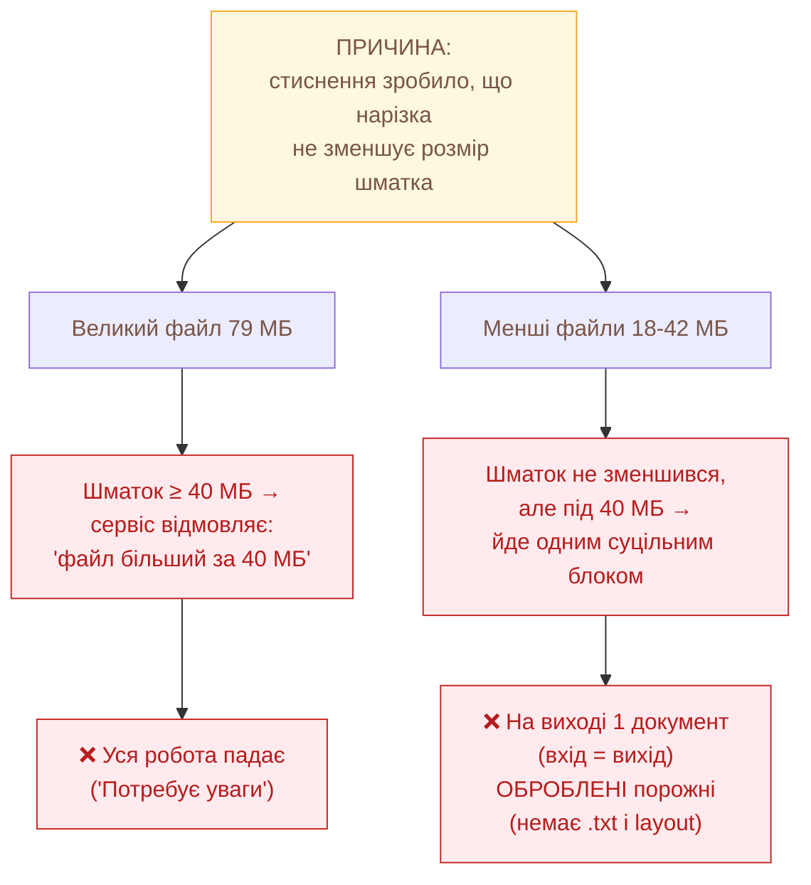
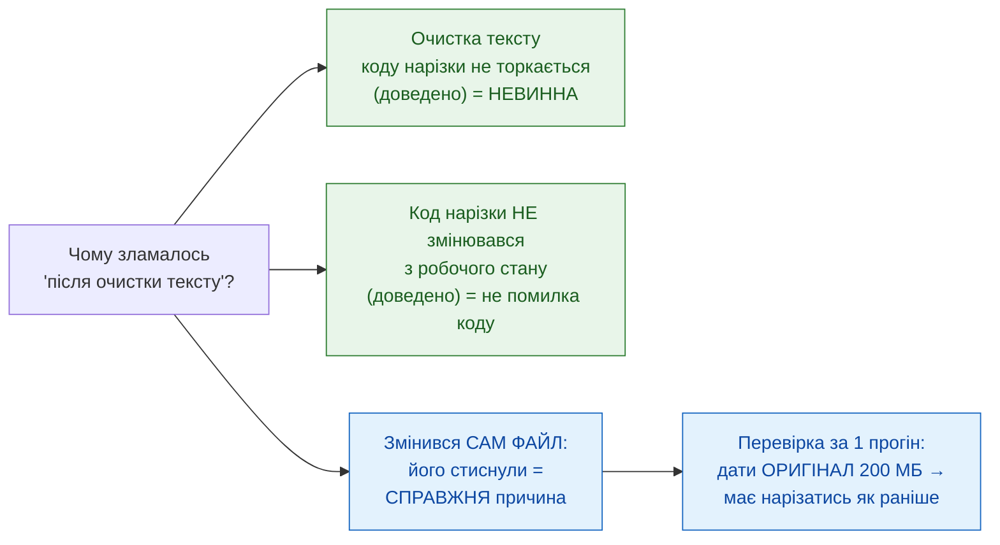
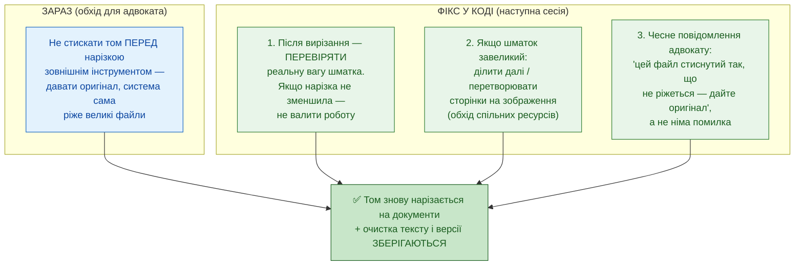

# Регресія нарізки DP — суть проблеми і як лікувати (для адвоката)

**Дата:** 2026-06-02 (оновлено після уточнення адвоката про стиснення файлу)
**Призначення:** пояснити простими словами, ЧОМУ ті самі файли раптом
перестали нарізатись, і ЯК це полагодити. Без інженерного жаргону.
**Повне технічне розслідування:** `docs/diagnostics/diagnostic_clean_text_pipeline_regression_FINDINGS.md`

> **Головне в одному реченні:** файл стиснули зовнішнім інструментом
> (200 МБ → 79 МБ), і це **зламало нарізку на сторінки** — тепер «вирізати
> кілька сторінок» дає шматок майже на весь файл. Нова «очистка тексту» НЕ винна,
> помилки в коді теж немає — змінився сам файл усередині.

> ⚠ **Поправка до першої версії цієї схеми.** Спершу я припустив «5 важких
> сторінок по 8 МБ = 40 МБ». Адвокат справедливо вказав: файл 79 МБ / 335 сторінок
> = лише 0,24 МБ на сторінку, така математика не сходиться. Правильна причина —
> стиснення (нижче).

---

## Картина 1 — ЩО МАЛО Б ВІДБУВАТИСЬ (нормальна робота)

---

## Картина 2 — ЧОМУ СТИСНЕННЯ ЛАМАЄ НАРІЗКУ (суть)

Нарізка вирізає сторінки, **копіюючи їх разом з усіма ресурсами**
(шрифти, зображення, спільні об'єкти), на які ці сторінки посилаються.

---

## Картина 3 — ДВА ПРОЯВИ ОДНІЄЇ ПРИЧИНИ

---

## Картина 4 — ХТО НЕ ВИНЕН (важливо для довіри)

---

## Картина 5 — ЯК ЛІКУВАТИ

---

## Підсумок словами адвоката

| Питання | Відповідь |
|---|---|
| Чому математика «5 сторінок = 40 МБ» не сходилась? | Бо вона була неправильна. 79 МБ / 335 стор. = 0,24 МБ/стор. Реальна причина інша — стиснення. |
| Що насправді зламалось? | Нарізка вирізає сторінки копіюванням. Після стиснення сторінки «зрослись» спільними ресурсами — вирізаєш кілька, а тягнеш майже весь файл. |
| Чому раніше (200 МБ) працювало? | Нестиснений файл мав незалежні сторінки — вирізання давало справді маленькі шматки. |
| Чи винна очистка тексту? | Ні. Доведено — не торкається нарізки. |
| Чи це помилка в коді? | Ні. Код нарізки не змінювався. Змінився сам файл (стиснення). |
| Що робити зараз? | Дати системі ОРИГІНАЛ (нестиснений) — вона сама ріже великі файли. Це ж підтвердить діагноз. |
| Що полагодити в коді? | Перевіряти реальну вагу шматка після нарізки; якщо не зменшився — ділити далі або переводити в зображення, а не валитись. |
