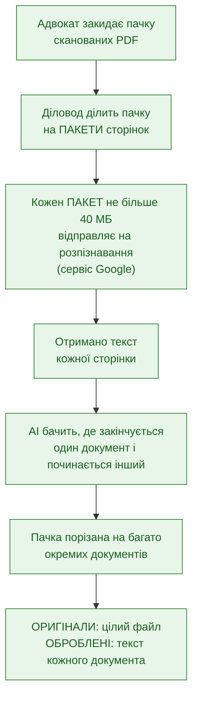
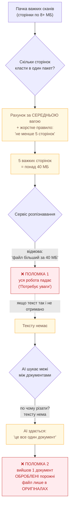
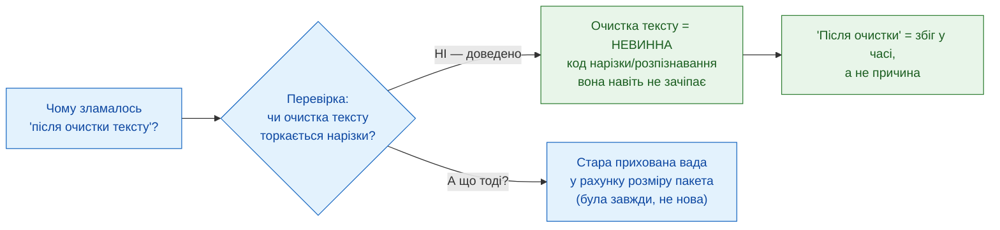
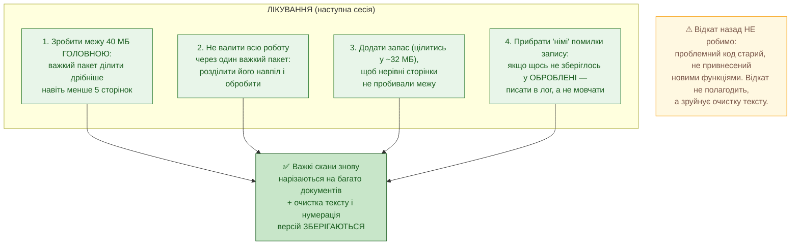

# Регресія нарізки DP — суть проблеми і як лікувати (для адвоката)

**Дата:** 2026-06-02
**Призначення:** пояснити простими словами, ЧОМУ ті самі файли раптом
перестали нарізатись, і ЯК це полагодити. Без інженерного жаргону.
**Повне технічне розслідування:** `docs/diagnostics/diagnostic_clean_text_pipeline_regression_FINDINGS.md`

> **Головне в одному реченні:** нова «очистка тексту» НЕ винна — винна стара
> прихована вада в тому, як система рахує розмір пакета сторінок для
> розпізнавання; вона була завжди, але «вистрілила» саме на важких сканах.

---

## Картина 1 — ЩО МАЛО Б ВІДБУВАТИСЬ (нормальна робота)

---

## Картина 2 — ЩО ЛАМАЄТЬСЯ ЗАРАЗ (дві окремі поломки)

**Звідки взялося «правило не менше 5».** Колись його додали, щоб не дробити роботу
на безліч крихітних пакетів (це сповільнює). Але ніхто не передбачив випадок, коли
сторінки настільки важкі, що навіть 5 уже не влазять у 40 МБ. Тоді «мінімум 5»
перемагає головну межу «40 МБ» — і ламає її.

---

## Картина 3 — ХТО НЕ ВИНЕН (важливо для довіри)

---

## Картина 4 — ЯК ЛІКУВАТИ (план фіксу)

---

## Підсумок словами адвоката

| Питання | Відповідь |
|---|---|
| Чи винна нова «очистка тексту»? | **Ні.** Доведено — вона не торкається нарізки. |
| Що ж тоді зламалось? | Стара прихована вада: правило «мінімум 5 сторінок у пакеті» перемагає межу «40 МБ» на важких сканах. |
| Чому раптом саме зараз? | Вада була завжди; «вистрілила» на конкретних важких файлах. Точний тригер підтвердить один тестовий прогін. |
| Що буде з очисткою тексту? | **Зберігається повністю.** Лікуємо лише старий рахунок розмірів. |
| Чи треба щось відкочувати? | **Ні.** Відкат не допоможе і зашкодить. Потрібен прицільний фікс. |
