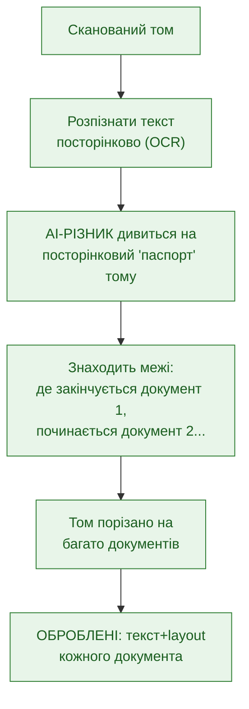
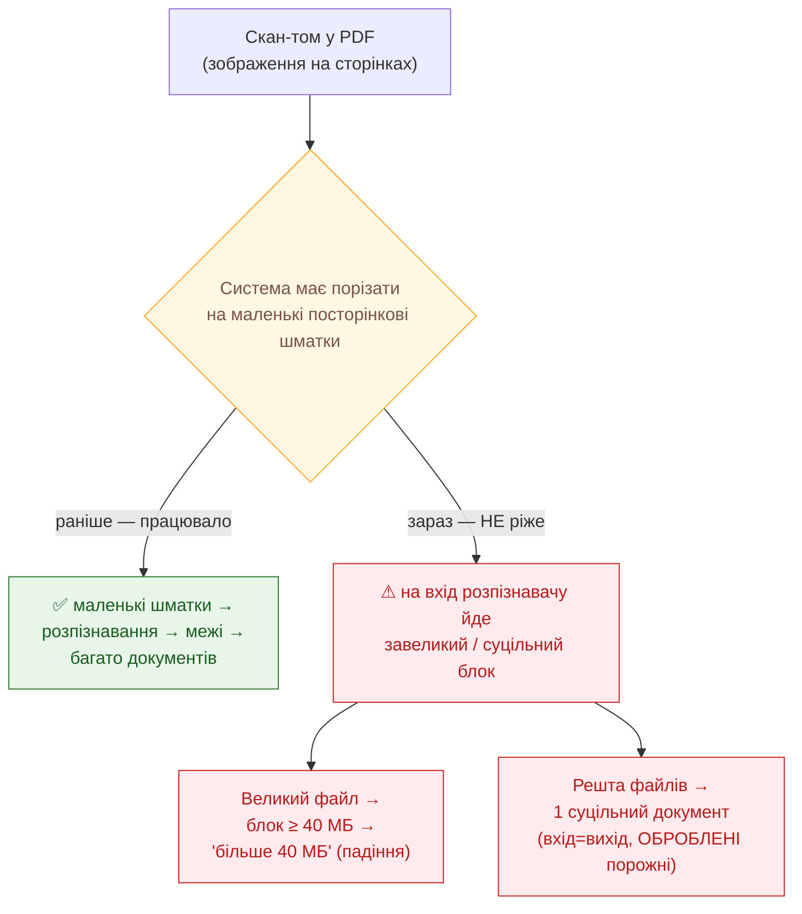
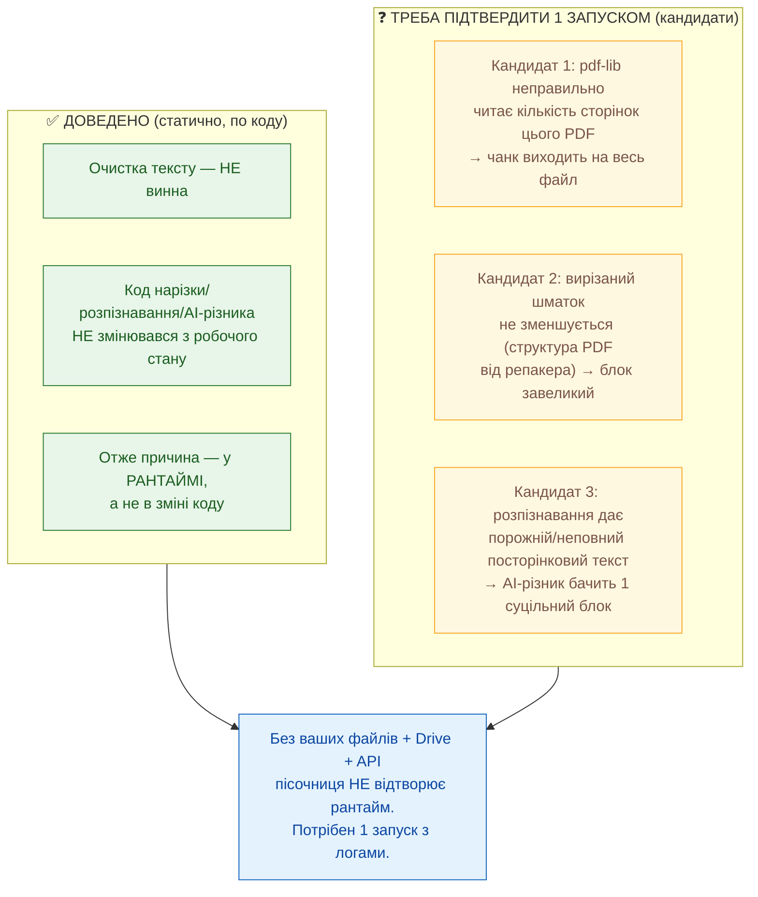
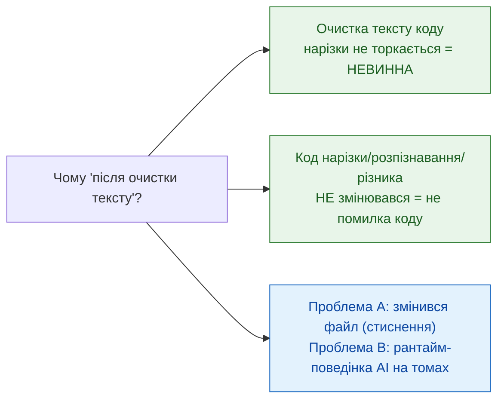
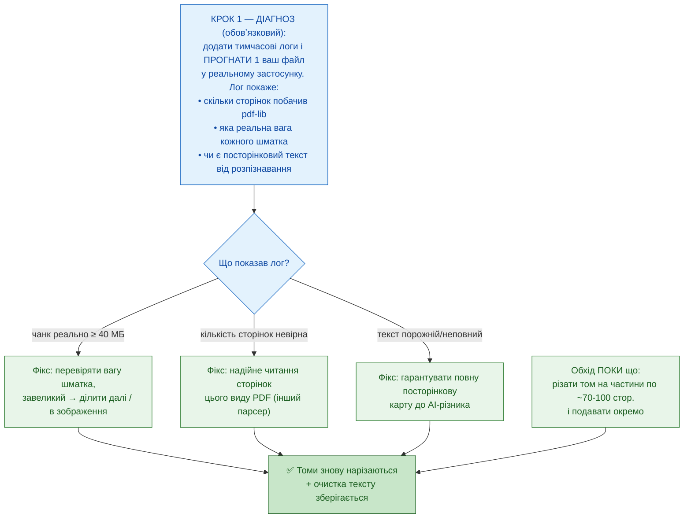

# Регресія нарізки DP — суть проблеми і як лікувати (для адвоката)

**Дата:** 2026-06-02 (оновлено: адвокат уточнив — нестиснені файли теж дають 1 документ)
**Призначення:** пояснити простими словами ДВІ окремі проблеми DP і як їх лікувати.
**Повне технічне розслідування:** `docs/diagnostics/diagnostic_clean_text_pipeline_regression_FINDINGS.md`

> **Головне:** усі файли — це **скани (зображення), запечені в PDF**. Симптом єдиний:
> система **перестала різати том на сторінки/документи** — на вхід розпізнавачу йде
> завеликий або суцільний блок замість маленьких посторінкових шматків. Звідси два
> прояви: великий файл → «більше 40 МБ» (падіння); решта → 1 документ (вхід=вихід).
> Нова «очистка тексту» НЕ винна. Код нарізки/розпізнавання **не змінювався**.

> ⚠ **ЧЕСНО про мої попередні версії — усі три були неповні/хибні:**
> «floor 5 сторінок» (хибна математика), «спільні ресурси від стиснення» (не тримається
> для простих сканів — адвокат справедливо вказав: downscale зображень не створює
> «спільних ресурсів»). **Я НЕ можу назвати точну причину зі статичного коду** — бо
> код не змінювався, отже причина в РАНТАЙМІ, а пісочниця не має ваших файлів/Drive/API,
> щоб це відтворити. Нижче — чесна картина і що саме треба запустити, щоб назвати причину.

---

## Картина 1 — ЯК МАЛО Б ПРАЦЮВАТИ

---

## Картина 2 — ЄДИНИЙ СИМПТОМ: нарізка не відбувається

---

## Картина 3 — ЧЕСНО: ЩО ДОВЕДЕНО vs ЩО ТРЕБА ЗАПУСТИТИ

> **Я більше НЕ вгадую механізм.** Тричі назвав конкретну причину (floor / спільні
> ресурси) — і двічі помилився, бо без живого запуску це лише здогад. Чесна позиція:
> причина в рантаймі (один із 3 кандидатів вище), і назвати точно можна ЛИШЕ
> прогоном одного вашого файлу з діагностичними логами (чанк-байти, кількість сторінок,
> чи є посторінковий текст). Це і є наступний крок.

---

## Картина 4 — ХТО НЕ ВИНЕН

---

## Картина 5 — ЯК ЛІКУВАТИ (спершу — назвати причину)

---

## Підсумок словами адвоката

| Питання | Чесна відповідь |
|---|---|
| Яка точна причина? | **Поки не названа.** Код не змінювався → причина в рантаймі. Тричі вгадував — двічі помилився. Більше не вгадую. |
| Чи винна очистка тексту? | **Ні.** Доведено — коду нарізки не торкається. |
| Чи це помилка в коді нарізки? | Код нарізки/розпізнавання/AI-різника **не змінювався** з робочого стану. Симптом — рантайм. |
| Чому ж тоді ламається? | Один із 3 кандидатів: невірна к-сть сторінок / шматок не зменшується / порожній посторінковий текст. Який — покаже лог. |
| Що треба, щоб назвати точно? | **1 запуск вашого файлу з діагностичними логами** в реальному застосунку. Пісочниця цього не може (нема файлів/Drive/API). |
| Обхід зараз? | Різати том на частини по ~70-100 сторінок і подавати окремо. |
